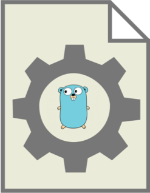

# go-makefile-gen

[](https://pkg.go.dev/github.com/tiagomelo/go-makefile-gen)



A simple utility tool for generating a [Makefile](https://en.wikipedia.org/wiki/Make_(software)#Makefiles) to your [Go](https://go.dev/) project. It also offers the ability of adding a new target to a given [Makefile](https://en.wikipedia.org/wiki/Make_(software)#Makefiles).

## installation

```
go install github.com/tiagomelo/go-makefile-gen/cmd/gomakefile@v0.1.3
```

It will be installed into `bin` directory of your `$GOPATH` env.

```
go env | grep GOPATH
```

## CLI usage

To be able to call `gomakefile` without specifing the full path to `$GOPATH/bin`, remember to add it to your path.

e.g. `export PATH="$GOPATH/bin:$PATH"`

### creating a `Makefile`

```
gomakefile generate 
```

It generates this `Makefile` in the current directory:

```
.PHONY: help
## help: shows this help message
help:
	@ echo "Usage: make [target]\n"
	@ sed -n 's/^##//p' ${MAKEFILE_LIST} | column -t -s ':' |  sed -e 's/^/ /'

.PHONY: test
## test: run unit tests
test:
	@ go test -v ./... -count=1

.PHONY: coverage
## coverage: run unit tests and generate coverage report in html format
coverage:
	@ go test -coverprofile=coverage.out ./...  && go tool cover -html=coverage.out
```

You can also specify the desired path for it:

```
gomakefile generate -p <path/to/Makefile>
```

### overwriting an existing `Makefile`

```
gomakefile generate -o true
```

### adding a new target to a `Makefile`

```
gomakefile addtarget -t "my-new-target"
```

It adds the desired target to the `Makefile` that is present in the currenty directory:

```
.PHONY: my-new-target
## my-new-target: explain what my-new-target does
my-new-target:
```

You can also specify the path for the existing `Makefile` you want to add the target to:

```
gomakefile addtarget -t "my-new-target" -p <path/to/Makefile>
```

### adding a new target with content to a `Makefile`

```
gomakefile addtarget -t "my-new-target" -c $'@ do it\n\t@ do that\n\t@ echo "ok"'
```

It adds the desired target to the `Makefile` that is present in the currenty directory:

```
.PHONY: my-new-target
## my-new-target: explain what my-new-target does
my-new-target:
	@ do it
	@ do that
	@ echo "ok"
```

You can also specify the path for the existing `Makefile` you want to add the target to:

```
gomakefile addtarget -t "my-new-target" -p <path/to/Makefile> -c $'@ do it\n\t@ do that\n\t@ echo "ok"'
```

### adding a new target with dependencies to a `Makefile`

```
gomakefile addtarget -t "my-new-target" -d target-one -d target-two
```

It adds the desired target to the `Makefile` that is present in the currenty directory:

```
.PHONY: my-new-target
## my-new-target: explain what my-new-target does
my-new-target: target-one target-two

```

You can also specify the path for the existing `Makefile` you want to add the target to:

```
gomakefile addtarget -t "my-new-target" -d target-one -d target-two -p <path/to/Makefile>
```

### adding a new target with content and dependencies to a `Makefile`

```
gomakefile addtarget -t "my-new-target" -d target-one -d target-two -c '@ echo "ok"'
```

It adds the desired target to the `Makefile` that is present in the currenty directory:

```
.PHONY: my-new-target
## my-new-target: explain what my-new-target does
my-new-target: target-one target-two
	@ echo "ok"
```

You can also specify the path for the existing `Makefile` you want to add the target to:

```
gomakefile addtarget -t "my-new-target" -d target-one -d target-two -c '@ echo "ok"' -p <path/to/Makefile>
```

## using it in your Go code

```
go get github.com/tiagomelo/go-makefile-gen
```

### creating a `Makefile`

[examples/create/main.go](./examples/create/main.go)

```
package main

import (
	"fmt"
	"os"

	"github.com/tiagomelo/go-makefile-gen/mfile"
)

func main() {
	const makeFilePath = "."
	// Pass false if you don't want to overwrite the existing Makefile.
	if err := mfile.GenerateMakefile(makeFilePath, false); err != nil {
		fmt.Println(err)
		os.Exit(1)
	}
}

```

### overwriting an existing `Makefile`

[examples/create/main.go](./examples/create/main.go)

```
package main

import (
	"fmt"
	"os"

	"github.com/tiagomelo/go-makefile-gen/mfile"
)

func main() {
	const makeFilePath = "."
	// Pass false if you don't want to overwrite the existing Makefile.
	if err := mfile.GenerateMakefile(makeFilePath, true); err != nil {
		fmt.Println(err)
		os.Exit(1)
	}
}

```

### adding a new target to a `Makefile`

[examples/addtarget/main.go](./examples/addtarget/main.go)

```
package main

import (
	"fmt"
	"os"

	"github.com/tiagomelo/go-makefile-gen/mfile"
)

func main() {
	const makeFilePath = "."
	targetName := "my-target"
	if err := mfile.AddTargetToMakefile(makeFilePath, targetName); err != nil {
		fmt.Println(err)
		os.Exit(1)
	}
}
```

### adding a new target with content to a `Makefile`

[examples/addtarget/withcontent/main.go](./examples/addtarget/withcontent/main.go)

```
package main

import (
	"fmt"
	"os"

	"github.com/tiagomelo/go-makefile-gen/mfile"
)

func main() {
	const makeFilePath = "."
	targetName := "my-target"
	targetContent := `@ do it\n\t@ do that\n\t@ echo "ok"`
	if err := mfile.AddTargetWithContentToMakefile(makeFilePath, targetName, targetContent); err != nil {
		fmt.Println(err)
		os.Exit(1)
	}
}

```

### adding a new target with dependencies to a `Makefile`

[examples/addtarget/withdependencies/main.go](./examples/addtarget/withdependencies/main.go)

```
package main

import (
	"fmt"
	"os"

	"github.com/tiagomelo/go-makefile-gen/mfile"
)

func main() {
	const makeFilePath = "."
	targetName := "my-target"
	targetDependencies := []string{"target-one", "target-two"}
	if err := mfile.AddTargetWithDependenciesToMakefile(makeFilePath, targetName, targetDependencies); err != nil {
		fmt.Println(err)
		os.Exit(1)
	}
}

```

### adding a new target with content and dependencies to a `Makefile`

[examples/addtarget/withdependencies/withcontent/main.go](./examples/addtarget/withdependencies/withcontent/main.go)

```
package main

import (
	"fmt"
	"os"

	"github.com/tiagomelo/go-makefile-gen/mfile"
)

func main() {
	const makeFilePath = "."
	targetName := "my-target"
	targetDependencies := []string{"target-one", "target-two"}
	targetContent := `@ do it\n\t@ do that\n\t@ echo "ok"`
	if err := mfile.AddTargetWithContentAndDependenciesToMakefile(makeFilePath, targetName, targetContent, targetDependencies); err != nil {
		fmt.Println(err)
		os.Exit(1)
	}
}

```

## unit tests

```
make test
```

## unit tests coverage

```
make coverage
```